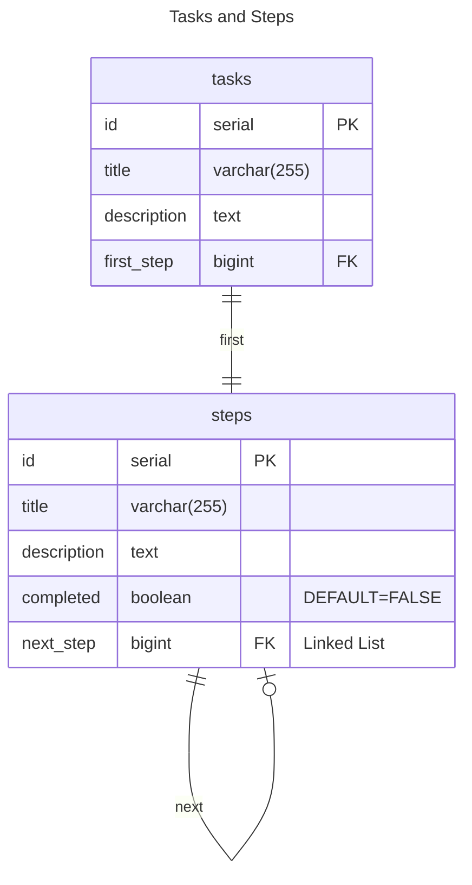
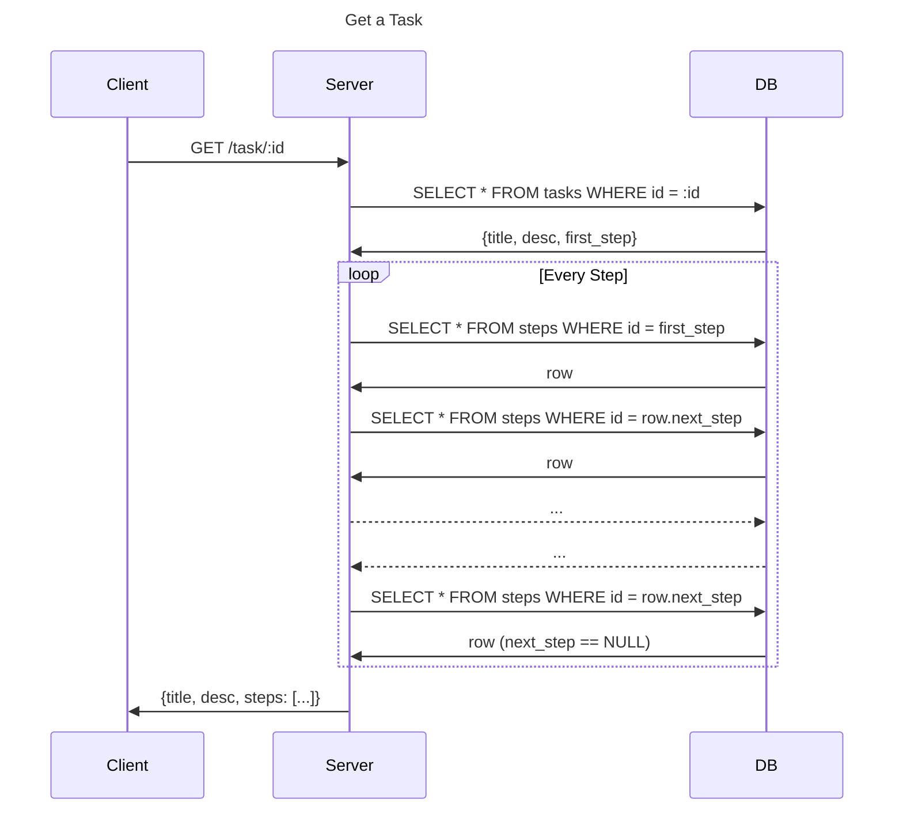
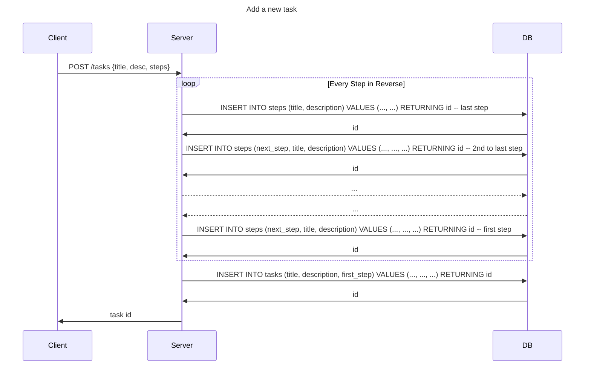
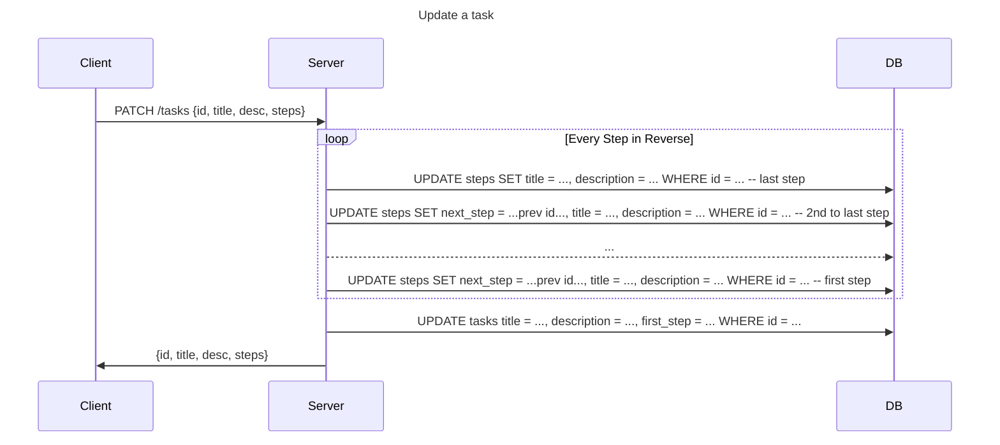

# Client / Server - express.js

## Building

### Database

To start the database, you can use [docker compose](https://docs.docker.com/compose/):

```bash
docker compose up
```

... optionally starting the database as a [daemon](https://en.wikipedia.org/wiki/Daemon_(computing)):

```bash
docker compose up -d
```

### NPM Dependencies

```bash
npm ci
```

### Client & Server

You can get the client built and server running just with `npm start`:

```bash
npm start
```

This will build the client with [vite](https://vitejs.dev/), which will provide lots of nice
features like [cache busting](https://www.keycdn.com/support/what-is-cache-busting),
"browserification" of ES6 modules, etc.

You can also watch changes:

```bash
npm run watch
```

## Documentation

### Entity Relationship Diagram

The ERD is simple - there are tasks and steps for those tasks - a task starts with one step,
and each step points to its next step, if it exists:



### Client / Server / DB Sequence Diagrams

Here are some sequence diagrams to help discuss how the server should behaive.

#### Initialization

The Client will need to initialize and fetch all the tasks:


#### Getting a specific task



#### Adding a new task




#### Updating a task


