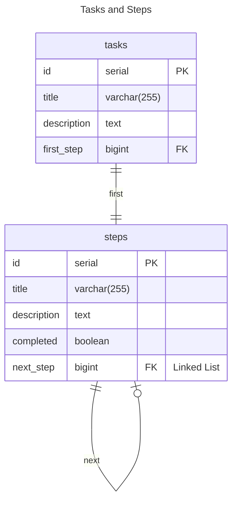
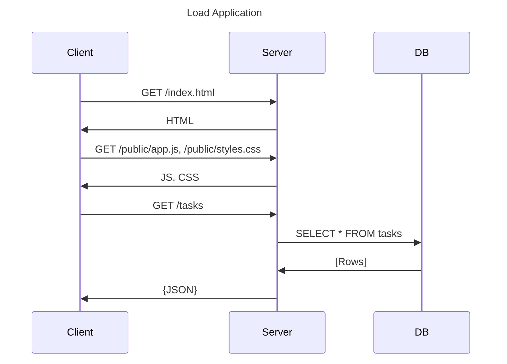
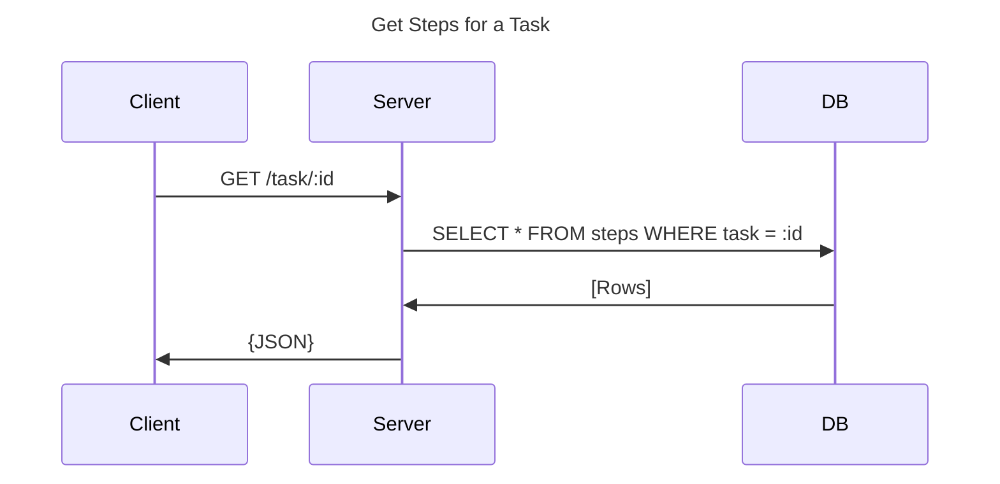

# Client / Server - express.js

To start the database, you can use [docker compose](https://docs.docker.com/compose/):

```bash
docker compose up
```

... optionally starting the database as a [daemon](https://en.wikipedia.org/wiki/Daemon_(computing)):


```bash
docker compose up -d
```

Then, you can get node running:

```bash
npm ci
node app.js
```

## Documentation


### Entity Relationship Diagram

The ERD is simple - there are tasks and steps for those tasks - a task starts with one step,
and each step points to its next step, if it exists:



### Client / Server / DB Sequence Diagrams

Here are some sequence diagrams to help discuss how the server should behaive.

#### Initialization

The Client will need to initialize and fetch all the tasks:



#### Getting the steps of a specific task


