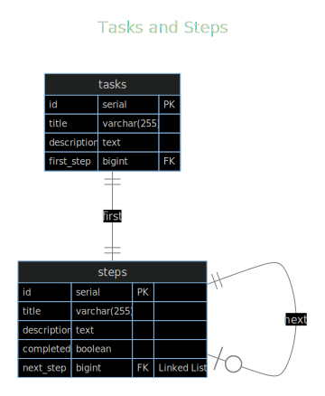

# Entity Relationship Diagram

The ERD is simple - there are tasks and steps for those tasks - a task starts with one step,
and each step points to its next step, if it exists:

# Client / Server / DB Sequence Diagrams

Here are some sequence diagrams to help discuss how the server should behaive.

## Initialization

The Client will need to initialize and fetch all the tasks:

